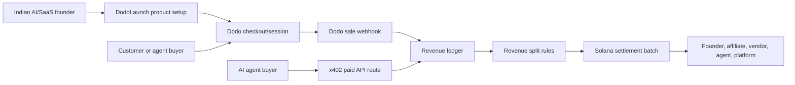

# Hackathon Win Plan: DodoLaunch India

## Product Bet

Build **DodoLaunch India**, a launchpad that helps Indian AI and SaaS builders create paid products with Dodo Payments and automate revenue splits through Solana-ready settlement batches.

**One-line pitch:** DodoLaunch turns Dodo Payments into the launch rail for Indian AI/SaaS products and Solana stablecoins into the programmable revenue-split rail.

This is stronger than a generic payout dashboard because it creates revenue:

- **Founders earn** by selling subscriptions, API credits, templates, and AI tools.
- **Dodo earns** because the product brings new merchants, checkout sessions, subscriptions, and payment volume.
- **DodoLaunch earns** through a platform fee on launched products.
- **Solana matters** because revenue is split programmatically between founder, affiliate, vendor, agent/runtime provider, and platform.
- **x402 bonus angle** adds paid API access for AI agents and autonomous buyers.

## Free Build Constraint

The product can generate real revenue later, but Jerreen should spend **$0 building and demoing it**.

- Default Dodo path is demo mode; free Dodo test credentials are optional.
- Default Solana path is payout preview mode; real devnet proof links require an actual devnet broadcast.
- No mainnet transactions during the hackathon build.
- No paid RPC.
- No hosted database bill.
- No paid AI, analytics, email, storage, or auth services.
- No committed secrets or private keys.
- Vercel deployment must fit the free tier.

## User

Primary user: an Indian AI/SaaS builder who wants to sell a product quickly without building billing, affiliate tracking, vendor splits, or payout operations.

Secondary users:

- Affiliates who help distribute the product.
- Data/API vendors who need usage-based revenue share.
- Agent/runtime providers who get paid when their service is used.
- Dodo Payments, which gets more merchants and checkout volume.

## Winning Demo Story

The demo should feel like launching a real paid product.

1. Founder creates a paid product: **SupportAgent Pro credit pack**.
2. DodoLaunch creates a Dodo checkout or demo checkout.
3. A Dodo sale webhook marks the product as paid.
4. The revenue ledger records the sale.
5. Split rules distribute revenue:
   - 70% founder treasury
   - 10% launch affiliate
   - 10% data/API vendor
   - 5% agent runtime provider
   - 5% DodoLaunch platform fee
6. Solana devnet/payout preview prepares every split; real explorer proof is only shown after devnet broadcast.
7. x402 demo shows an agent buying paid API access and joining the same revenue ledger.
8. Judges see a product that can make money for founders, Dodo, and us.

## MVP Scope

### Must Ship

- Launch dashboard for one paid AI/SaaS product.
- Founder workspace for product name, buyer, amount, launch URL, and pitch note.
- Dodo checkout creation route with demo fallback.
- Dodo sale webhook route.
- Revenue ledger.
- Split model with founder, affiliate, vendor, agent/runtime, and platform fee.
- CSV export for revenue split report.
- Solana settlement batch preview with no fake explorer links.
- x402-style paid API endpoint demo.
- README with free build path and revenue model.
- Demo script for a 2-minute judging walkthrough.

### Should Ship

- CSV export for revenue split report.
- Product configuration form.
- Screenshot/GIF for submission.
- Vercel free-tier deployment.
- Submission copy explaining why this helps Dodo acquire merchants.

### Do Not Build Yet

- Real production custody.
- Mainnet payments.
- Paid RPC.
- Hosted database.
- KYC/KYB.
- Fiat offramp.
- Full marketplace discovery.

Those come after the hackathon if the demo gets traction.

## Architecture

Core entities:

- `DodoCheckout`: paid product checkout/session.
- `DodoPaymentEvent`: sale webhook event.
- `SettlementEntry`: normalized product revenue.
- `Recipient`: founder, affiliate, vendor, agent/runtime, or platform.
- `PayoutBatch`: Solana-ready revenue split batch.
- `X402Event`: paid API/agent access event.

## 2-Day Finish Plan

### Day 1: Product Pivot + Core Demo

- Rename visible product to DodoLaunch India.
- Make dashboard tell the launchpad story.
- Show paid product, Dodo sale event, revenue ledger, split model, platform fee, and Solana payout preview.
- Keep free build path in docs, but not as the product pitch.
- Verify app works with empty `.env.local`.

### Day 2: Submission Polish

- Add CSV export or screenshot-ready split report if time allows.
- Deploy on Vercel free tier.
- Record/write 2-minute demo script.
- Finalize README and hackathon plan.
- Run build, typecheck, audit, and secret scan.
- Submit GitHub, Vercel URL, and demo story.

## Demo Script

1. "This is DodoLaunch India, a launchpad for Indian AI and SaaS builders."
2. "A founder launches a paid AI product using Dodo Payments."
3. "When a Dodo sale succeeds, our webhook records revenue in the ledger."
4. "DodoLaunch automatically splits revenue between founder, affiliate, vendor, agent/runtime provider, and our platform fee."
5. "Solana provides the programmable settlement layer for those splits."
6. "x402 adds paid API access for AI agents."
7. "This helps founders earn, gives Dodo more merchants and checkout volume, and gives us a revenue model."

## Integration References

- Dodo Payments TypeScript SDK supports server-side REST API access, checkout sessions, retries, timeouts, and typed usage: https://docs.dodopayments.com/developer-resources/sdks/typescript
- Dodo webhooks should be verified, and the official SDK provides webhook helpers: https://docs.dodopayments.com/ar/developer-resources/webhooks
- Solana token transfers use token accounts and checked transfer instructions: https://solana.com/docs/tokens/basics/transfer-tokens
- x402 is an open HTTP 402 payment standard for programmatic payments: https://docs.x402.org/
