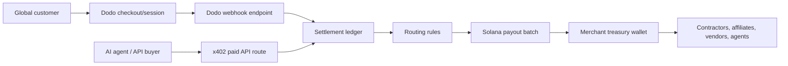

# Hackathon Win Plan: Solana Dodo India

## Product Bet

Build **DodoSettle India**, a zero-dollar revenue-to-payouts operating system for Indian SaaS, AI, and creator businesses.

**One-line pitch:** DodoSettle lets Indian SaaS founders collect global revenue through Dodo Payments, then route verified revenue into fast Solana devnet/simulated stablecoin payouts for contractors, vendors, affiliates, and AI agents without spending a dollar during the hackathon.

This is stronger than a simple stablecoin checkout because it uses both sides of the track:

- **Dodo Payments** handles real merchant monetization: checkout sessions, products, subscriptions, payment events, and webhooks.
- **Solana stablecoins** handle programmable settlement: batch payouts, splits, escrow, transparent settlement proofs, and near-instant cross-border movement.
- **India-specific pain** is clear: Indian SaaS/AI teams can sell globally, but cross-border payouts to contributors, vendors, and remote teams are slow, expensive, and operationally messy.
- **x402 bonus angle**: AI agents can pay for API/data access and receive revenue splits without manual billing workflows.
- **Zero-dollar delivery**: the default demo uses Dodo demo/test mode, Solana devnet/simulation, browser state, GitHub, and Vercel free tier only.

## Zero-Dollar Constraint

The project must not require a single dollar to build, demo, deploy, or judge.

- Default Dodo path is demo mode; free Dodo test credentials are optional.
- Default Solana path is simulation with devnet-style proof links; devnet tokens are optional.
- No mainnet transactions.
- No paid RPC.
- No hosted database bill.
- No paid AI, analytics, email, storage, or auth services.
- No committed secrets or private keys.
- Vercel deployment must fit the free tier.

## User

Primary user: an Indian SaaS or AI founder selling globally through Dodo Payments.

Secondary user: the finance/operator person who has to pay contractors, vendors, affiliates, and API providers after revenue lands.

Buyer pain:

- Customers can pay globally, but payout operations remain manual.
- Bank wires are slow and expensive.
- Contractor payout status is scattered across spreadsheets, bank portals, wallet records, and invoices.
- Revenue sharing with affiliates, creators, model providers, or AI agents is painful at small transaction sizes.

## Winning Demo Story

The demo should feel like a live business workflow, not a crypto toy.

1. Merchant creates a product/checkout in DodoSettle.
2. Dodo checkout session/payment link is created through the Dodo Payments API.
3. A simulated or test Dodo webhook marks payment as successful.
4. The app maps the payment into a settlement ledger.
5. The merchant applies routing rules:
   - 70% retained as merchant revenue
   - 20% contractor payout
   - 5% affiliate/referral payout
   - 5% AI/API provider payout
6. DodoSettle prepares a Solana stablecoin payout batch.
7. The app simulates or sends devnet token transfers.
8. The dashboard shows the status: Dodo payment verified, payout batch prepared, transfers settled, settlement proof available.
9. Bonus: an x402-protected API endpoint charges an AI agent per request and routes a split to the API provider.

## Prize Narrative

Judges should remember one sentence:

> DodoSettle turns Dodo Payments into the global revenue rail and Solana stablecoins into the programmable settlement rail for Indian SaaS and AI businesses.

Why this can win:

- It integrates Dodo in a meaningful way, not just as a logo or fake button.
- It solves a specific business problem for a specific user.
- It shows why Solana matters: speed, low cost, programmable batch settlement, revenue splits, and transparent transaction proofs.
- It has a credible India angle without getting trapped in regulated consumer remittance.
- It can show traction quickly through pilots with indie SaaS founders, agencies, AI tool builders, or creator businesses.

## MVP Scope

### Must Ship

- Landing/dashboard that explains the workflow visually.
- Merchant onboarding in demo mode.
- Dodo checkout creation route.
- Dodo webhook route with signature verification path.
- Settlement ledger table.
- Contractor/vendor/affiliate directory.
- Payout rule builder.
- Solana payout batch preview.
- x402-style HTTP 402 demo endpoint.
- Devnet transfer execution or realistic transaction simulation.
- Settlement proof page with links/signatures.
- Submission README with screenshots, architecture, setup, and demo script.

### Should Ship

- CSV import for contractors.
- Exportable payout report.
- Fee/time comparison against bank wire.
- Product selector for Dodo product IDs.
- Simple wallet connection for treasury authorization.
- x402-protected paid API route demo.

### Do Not Build Yet

- Full payroll compliance.
- KYC/KYB.
- Fiat offramp.
- Real production custody.
- Complex DeFi yield strategies.
- Multi-chain routing.

Those are future roadmap, not MVP. The hackathon demo must stay sharp.

## Architecture

Core tables/entities:

- `Merchant`: business profile, country, Dodo environment, treasury wallet.
- `DodoPaymentEvent`: raw webhook payload, event type, signature status, payment ID.
- `SettlementEntry`: normalized revenue item with currency, amount, status.
- `Recipient`: contractor/vendor/affiliate/agent name, role, wallet, region.
- `RoutingRule`: percentage or fixed amount split.
- `PayoutBatch`: recipients, amounts, token mint, network, status.
- `SolanaTransfer`: transaction signature, recipient, token, amount, confirmation status.

## Build Timeline

### Day 1: Product + Repo Foundation

- Public GitHub repo.
- README, license, env template.
- Next.js app shell.
- Dodo and Solana placeholder API routes.
- Hackathon plan document.

### Day 2: Dodo Core

- Add Dodo TypeScript SDK.
- Implement checkout/session creation in test mode.
- Add merchant product config through env or dashboard form.
- Store checkout attempts in local/demo ledger.

### Day 3: Webhooks + Ledger

- Implement raw-body webhook handling.
- Verify Dodo webhook signatures when secret is present.
- Normalize payment events into settlement entries.
- Add event replay/demo seed button for judging.

### Day 4: Recipient + Rules

- Build recipient directory.
- Add payout split rules.
- Generate payout batch from ledger entries.
- Validate totals, missing wallets, and unsupported rows.

### Day 5: Solana Stablecoin Transfers

- Add Solana web3 tooling.
- Support devnet token transfer simulation first.
- Add transaction builder and explorer links.
- Keep a no-key demo mode so judges can click through safely.

### Day 6: x402 Bonus

- Add a paid API route demo.
- Show agent request -> 402 payment required -> paid access path.
- Route x402 revenue into the same settlement ledger.

### Day 7: Polish Demo

- Replace generic UI with operator-grade dashboard.
- Add demo data that looks like a real Indian AI/SaaS company.
- Add screenshots/GIF.
- Write 2-minute demo script.

### Day 8-10: Traction Sprint

- Ask 5-10 Indian SaaS/AI founders/operators for feedback.
- Get 2-3 short quotes or pilot intents.
- Record one real payment/webhook test if Dodo test account is available.
- Add feedback section to submission.

### Day 11-12: Submission Hardening

- Vercel deploy.
- Confirm deployment uses free tier only.
- Verify mobile and desktop.
- Test fresh clone setup.
- Test empty `.env.local` zero-dollar mode.
- Add `.env.example` completeness.
- Run build and audit.
- Finalize README and demo video.

### Day 13: Submit

- Submit to Superteam Earn and Global Hackathon.
- Include GitHub, Vercel URL, demo video, pitch, and traction notes.

## Demo Script

1. "This is DodoSettle for Indian SaaS and AI founders."
2. "The founder sells globally with Dodo Payments."
3. "When a payment succeeds, our Dodo webhook records it in the settlement ledger."
4. "The founder has payout rules for contractors, affiliates, vendors, and agents."
5. "DodoSettle creates a Solana stablecoin payout batch from verified revenue."
6. "Compared with wires, settlement is faster, cheaper, and programmable."
7. "For AI-native products, x402 lets agents pay per API call and routes revenue automatically."
8. "This makes Dodo the revenue engine and Solana the settlement engine."

## What We Need From Jerreen

These are not blockers for building demo mode, but they make the submission stronger:

- Dodo test API key and webhook secret.
- A real Indian SaaS/AI use case to name in the demo.
- One or two real contractor/vendor payout examples.
- A short founder story: what problem are we personally solving?

If those are not ready, we continue with realistic demo data and swap real values later.

## Integration References

- Dodo Payments TypeScript SDK supports server-side REST API access, checkout sessions, retries, timeouts, and typed usage: https://docs.dodopayments.com/developer-resources/sdks/typescript
- Dodo webhooks should be verified, and the official SDK provides webhook helpers: https://docs.dodopayments.com/ar/developer-resources/webhooks
- Solana token transfers use token accounts and checked transfer instructions: https://solana.com/docs/tokens/basics/transfer-tokens
- x402 is an open HTTP 402 payment standard for programmatic payments: https://docs.x402.org/
